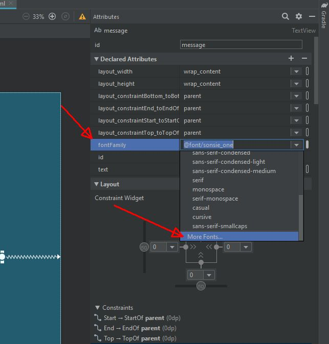
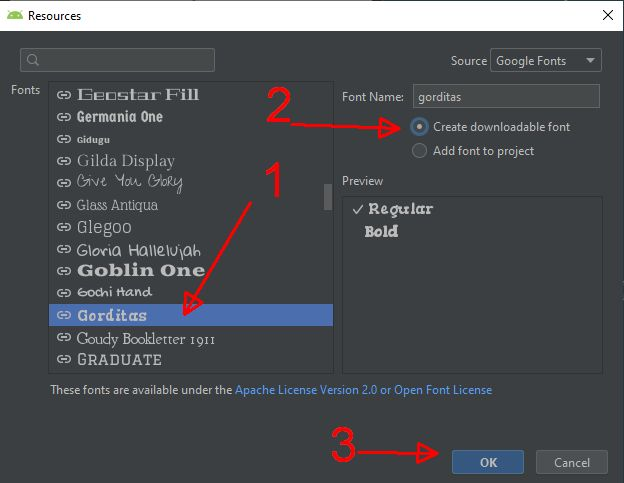
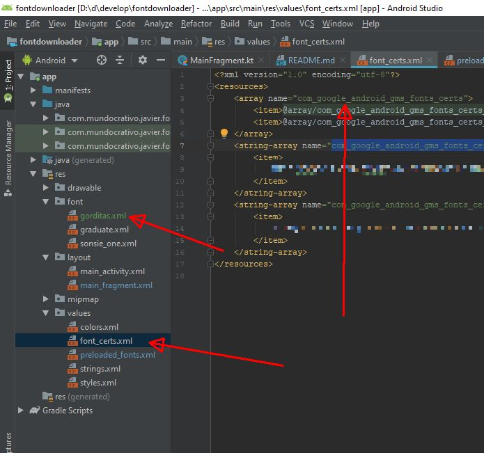

# AndroidFontdownloader
Description: Documentation and example of how to implement Downloadable Fonts in Android

## 1 - Documentation

Android 8.0 (API level 26) and Android Support Library 26 introduce support for APIs to request fonts from a provider application instead of bundling files into the APK or letting the APK download fonts. The feature is available on devices running Android API versions 14 and higher through the Support Library 26.
..[See in:](https://developer.android.com/guide/topics/ui/look-and-feel/downloadable-fonts.html)

Example article: [Custom and Downloadable Fonts on Android, By Ivan Kušt](https://www.raywenderlich.com/213-custom-and-downloadable-fonts-on-android)

## 2 - Example program

This is a base that you can use to implement Downloadable Fonts in Android

### 1- Get the certificate.

When you preload a font you get the certificates.

__To preload a font:__

Use any layout file with a textView field and in Attributes select for fontFamily 

Select a downloadable font to generate the xml. This also generate the font_certs.xml

You need to know if you have the certificate:

The certificate is provided by Android Studio (3+), and you can reference it in the code with the request:

        val query = "name=Creepster"
        val request = FontRequest(
            "com.google.android.gms.fonts",
            "com.google.android.gms",
            query,
            R.array.com_google_android_gms_fonts_certs
        )

This is a request for a Font named "Creepster", you have to use google font provider, so use the fields "com.google.android.gms.fonts" for providerAuthority and "com.google.android.gms" for providerPackage.

Then you need to request for the font.

        FontsContractCompat.requestFont(
            context!!,
            request,
            object : FontsContractCompat.FontRequestCallback() {
                override fun onTypefaceRetrieved(typeface: Typeface?) {
                    Log.v("msg","Letra encontrada")
                    message.typeface = typeface
                    message.setText("Font Creepster: Is Awesome")
                }

                override fun onTypefaceRequestFailed(reason: Int) {
                    Log.e("msg","Error: reason=$reason")
                }
            },
            handler!!
        )

in the above code the first you need to use the context, the request, the FontRequestCallback and the handler.

In the callback you receive the font, but if you have an error in the following link you can find the [reason code](https://developer.android.com/reference/android/provider/FontsContract.FontRequestCallback#FAIL_REASON_FONT_LOAD_ERROR)

In the example when the font is found, it change the Typeface or font of the message TextView control.

The handler is a standard android handler that doesn´t block the main loop.

    fun iniciaHandler(){
        val handlerThread = HandlerThread("fonatsHandler")
        handlerThread.start()
        handler = Handler(handlerThread.looper)
    }
    
The property handler is defined in the global class:

        private var handler: Handler? = null
        
until this part you can use downloadable fonts.
 
but if you need to get the list of the fonts to download continue reading...

### How to get The list of the fonts ???

Google fonts is a service that have a service and api key to access it, so you need to obtain the api key.

Also you can check the [Developer API](https://developers.google.com/fonts/docs/developer_api) that show how to get the api key

with this key you use a library developed by Firat Karababa that have a documentation of how to use this library: [Android Library to Dynamically Get a List of Google Fonts](https://proandroiddev.com/retrieve-available-downloadable-font-list-for-android-downloadable-font-list-library-731f8d6a7281)

This library is published in github. With the help of Jitpack you can add to your project: [How to add Jitpack library to your project](https://jitpack.io/)

If you need to [publish a library in jitpack](https://medium.com/@sgkantamani/how-to-create-and-publish-an-android-library-f37bf715932)

In the project build.gradle:

        allprojects {
            repositories {
                google()
                jcenter()
                maven { url 'https://jitpack.io' }
            }
        }

In the module build gradle:

        dependencies {
            implementation fileTree(dir: 'libs', include: ['*.jar'])
            ...
            ...
            ...          
            androidTestImplementation 'androidx.test.espresso:espresso-core:3.2.0'
        
            compile 'com.github.firatkarababa:downloadable-font-list-library:1.0.2'
        
        }
        
 in the AndroidManifest.xml
 
         <uses-permission android:name="android.permission.INTERNET" />
         <uses-permission android:name="android.permission.ACCESS_NETWORK_STATE"/>
         
 create a request with the code:
 
        DownloadableFontList.requestDownloadableFontList(calbackFont, "xxxxxxxxxxxxxxxxxxxxx")
        
Where "xxxxxxxxxxxxxxxxxxx" is your api key.

and the callbackFont is:

            val calbackFont = object  : DownloadableFontList.FontListCallback{
                override fun onFontListRetrieved(fontList: FontList?) {
        
                    //-- tenemos la font list
                    val listaNames =fontList!!.fontArrayList
                    listaNames.forEach {
                        Log.v("msg","query=${it.getQueryString()} ")
                    }
                    Log.v("msg","total fonts=${listaNames.size}")
                }
        
                override fun onTypefaceRequestFailed(p0: Int) {
        
                }
            }
            
In this example, the console is showing all of the queries that you can use to download a font.

